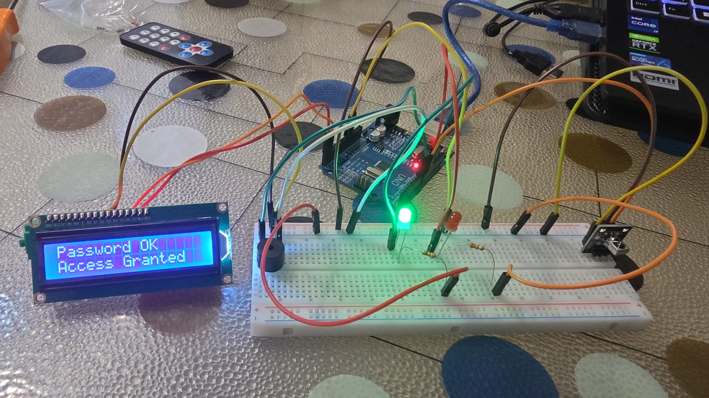
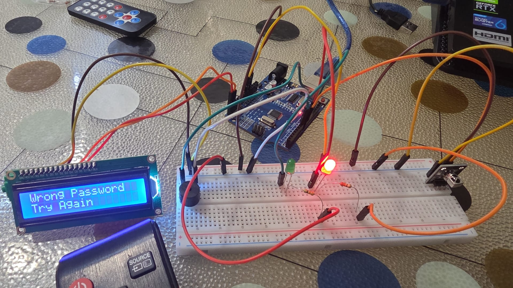
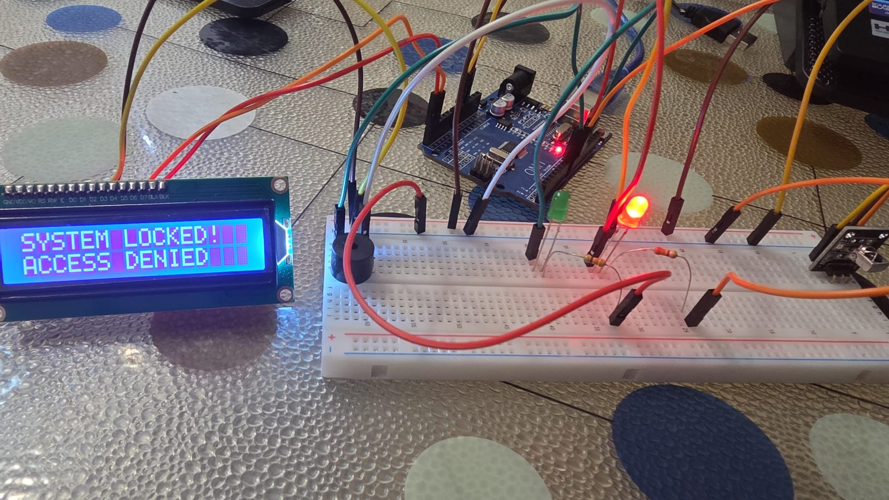

## 🔒 IR Security Safe with SQLite Logging

This project is a smart safe lock system that demonstrates advanced hardware-software integration, two-way UART communication, and data persistence. It combines an Arduino-based physical access control interface with a Python-based security logging backend.

  
  
  

### System Architecture

The system is divided into two interdependent layers:

* **Hardware Layer (Arduino):** 
  Acts as the physical interface. It decodes IR remote signals, maps them to digits, and validates a 6-digit passcode. It provides real-time visual (Red/Green LEDs) and auditory (Buzzer) feedback using an I2C LCD display. It also continuously listens to the Serial port for override commands.
* **Software Layer (Python & SQLite):** 
  Acts as the security backend. It listens to the COM port for `ACCESS_GRANTED` or `ACCESS_DENIED` signals and logs every attempt into a local SQLite database (`safe_logs.db`) with time stamps.

### Key Features
* **Two-Way Communication:** If the Python script detects 3 consecutive failed attempts, it proactively sends a `KILIT` (LOCK) string back to the Arduino. The Arduino parses this, raises a lockdown flag, and freezes the physical interface.
* **Database Integration:** Unlike standard terminal prints, all entry attempts are persistently stored in an SQL database, mimicking real-world access control systems.
* **Zero-Latency UX:** The hardware feedback loop is optimized to trigger LED state changes at the exact millisecond the LCD updates, before any blocking `delay()` functions run.

### Developer Notes & Lessons Learned
* **Array Indexing Bug:** During development, a logic error in the `for` loop (`i < 5` instead of `i < 6`) caused the system to ignore the last digit of the 6-digit password array. It was a solid reminder of how critical array boundaries are in C++.
* **Blocking Delays vs. Real-Time Feedback:** Initially, the system waited for the buzzer's `delay()` to finish before turning on the LEDs. By restructuring the sequence to trigger `digitalWrite(HIGH)` before the tone delays, the system achieved a much more responsive, industrial-grade feel.
