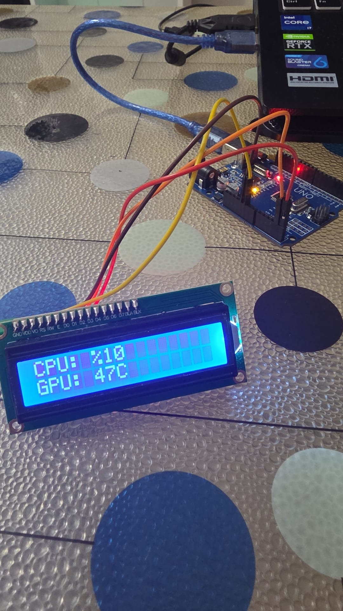

# PC Hardware Monitor 🖥️📊

**Project Date:** July 2026

## Overview

This project is a hardware-software integration that tracks and displays real-time CPU and GPU performance metrics. A Python script running on the host machine fetches system telemetry (usage percentages and temperatures) using `psutil` and `GPUtil`, and transmits this data via serial communication. An Arduino microcontroller receives and parses the incoming data string, displaying the live statistics on an I2C LCD screen.

  <!-- Add your hardware photos to the images folder and update the names below -->
  

## Technologies Used

* **Hardware:** Arduino Uno, I2C 16x2 LCD Display
* **Software:** Python (`psutil`, `GPUtil`, `pyserial`), C++ (Arduino IDE)
* **Key Concepts:** Serial Communication, System Telemetry, String Parsing, I2C Protocol, Hardware Monitoring

## Project Structure

* `/lcd_system_display`: Contains the `.ino` firmware for the Arduino microcontroller.
* `/python_script`: Contains the `.py` script responsible for fetching system data and transmitting it over the COM port.

## Hardware Wiring

* **I2C LCD Display:** SDA -> A4, SCL -> A5, VCC -> 5V, GND -> GND

## How to Run

1. Connect the I2C LCD to the Arduino according to the wiring guide.
2. Upload the `.ino` sketch located in the `/lcd_system_display` folder to your Arduino.
3. **Important:** Close the Arduino IDE Serial Monitor to ensure the COM port is completely available.
4. Install the required Python dependencies via terminal:
   `pip install psutil GPUtil pyserial`
5. Run the Python script located in the `/python_script` folder. The system stats will immediately appear on the LCD screen.
